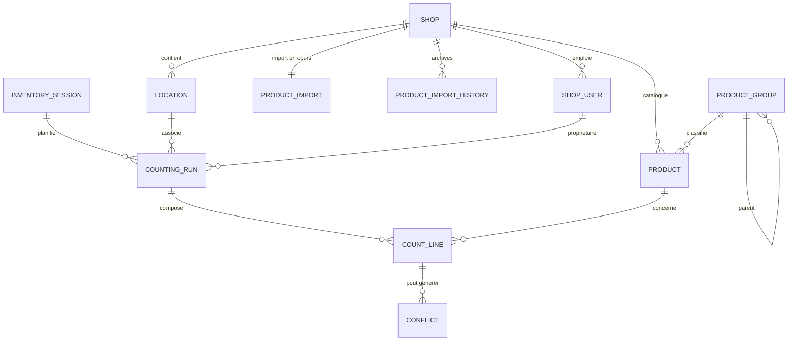

# Diagramme BDD (Mermaid)

Diagramme généré en Mermaid à partir des migrations actuelles. La source est dans `docs/BDD/diagramme.mmd` et peut être copiée dans un éditeur Mermaid compatible pour rendu.

