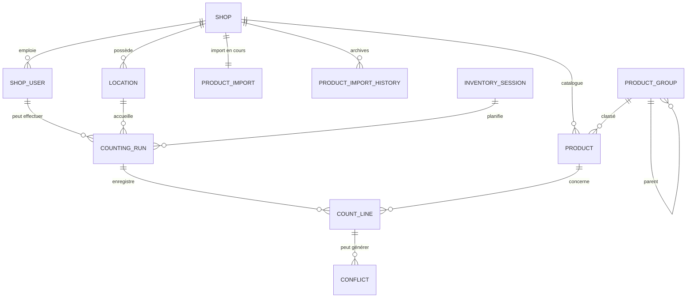
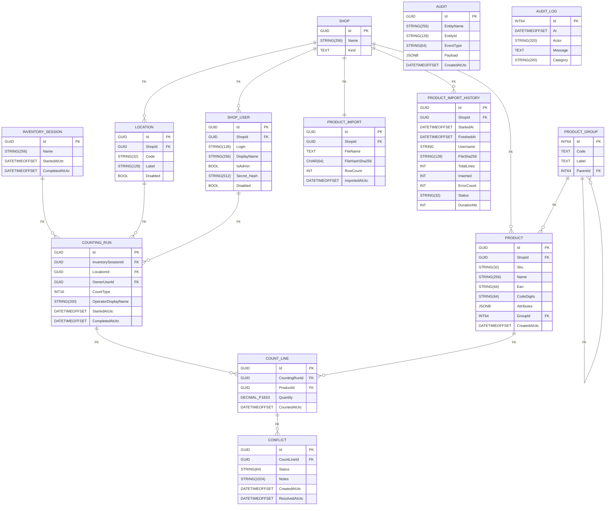

# Modélisation des données

Ce document synthétise la structure actuelle de la base PostgreSQL pilotée par les migrations FluentMigrator du projet `inventory-infra`. Il est à jour de la migration de baseline `20260101_000001_InitialSchema`.

## Politique de migrations

- Le schéma est piloté exclusivement par FluentMigrator. Toute évolution passe par une classe dans `src/inventory-infra/Migrations` et doit être versionnée par revue.
- Les identifiants suivent le format `yyyyMMdd_HHmmss_Description` (ex. `20260101_000001_InitialSchema`) pour garantir l'ordre d'exécution.
- L'API embarque `FluentMigrator.Runner.Postgres` :
  - les migrations s'appliquent automatiquement en `Development`, `Docker`, `CI`, `Test` et `Testing` ;
  - en production, elles ne sont jouées que si `APPLY_MIGRATIONS=true` **et** `DISABLE_MIGRATIONS=false`.
- La table `public."VersionInfo"` trace la version la plus récente. Ne modifiez jamais cette table manuellement hors des opérations de baseline décrites plus bas.
- Aucun script SQL ad-hoc n'est accepté : même un ajout d'index doit être couvert par une migration.

### Exécution manuelle

Avant toute exécution, positionnez `ConnectionStrings__Default` vers l'environnement cible.

```bash
# Linux / macOS
APPLY_MIGRATIONS=true DISABLE_MIGRATIONS=false \
  dotnet run --project src/inventory-api --no-build

# PowerShell
$env:APPLY_MIGRATIONS = 'true'
$env:DISABLE_MIGRATIONS = 'false'
$env:ConnectionStrings__Default = 'Host=<host>;Port=5432;Database=inventory;Username=<user>;Password=<pwd>'
dotnet run --project src/inventory-api --no-build
```

Dans Docker Compose, le service `api` expose déjà ces variables ; un `docker compose up` rejouera les migrations si une nouvelle version est présente. Une fois la montée terminée, remettez `APPLY_MIGRATIONS` à `false` pour éviter toute exécution involontaire.\n\n## Modèle Conceptuel de Données (MCD)



- **Shop** : entité boutique (`Kind` ∈ {`boutique`,`lumiere`,`camera`}) servant de racine aux catalogues et aux utilisateurs.
- **Location** : zone physique (codes `B1` à `B20`, `S1` à `S19`) rattachée à une boutique et pouvant être désactivée.
- **ShopUser** : compte magasin avec contrainte d'unicité par boutique sur `Login` et `DisplayName`.
- **ProductGroup** : classification hiérarchique optionnelle des produits (auto-référence `ParentId`).
- **Product** : référence commerciale contextualisée par boutique (`ShopId`), enrichie d'attributs JSON et d'index de recherche trigramme.
- **ProductImport** / **ProductImportHistory** : suivi des imports catalogue (état courant + historique horodaté).
- **InventorySession**, **CountingRun**, **CountLine**, **Conflict** : cycle de vie d'un inventaire terrain.
- **Audit** et **audit_logs** : journalisation fonctionnelle et technique indépendante du domaine.

## Modèle Physique de Données (MPD)



> ℹ️ `DECIMAL_P18S3` correspond à une colonne `DECIMAL(18,3)` dans PostgreSQL. La notation a été ajustée pour rester compatible avec Mermaid.

## Synthèse des contraintes

| Table | Clés principales | Index / Contraintes notables |
| --- | --- | --- |
| `Shop` | `Id` | `ck_shop_kind_allowed`, index unique `UQ_Shop_LowerName`, index `ix_shop_kind` sur `lower(Kind)`. |
| `ShopUser` | `Id` | Index unique `UQ_ShopUser_Shop_LowerLogin`, contrainte `uq_shopuser_shopid_displayname`, index `ix_shopuser_shopid_displayname`. |
| `ProductGroup` | `Id` | Contrainte `uq_productgroup_code`, auto-FK `FK_ProductGroup_ProductGroup_ParentId`, index GIN `ix_productgroup_label_trgm`. |
| `Product` | `Id` | Index unique `UX_Product_Shop_LowerSku`, index partiel `IX_Product_Shop_Ean`, index `IX_Product_Shop_LowerSku`, `IX_Product_Shop_LowerEan`, `IX_Product_Shop_CodeDigits`, `ix_product_codedigits`, GIN `ix_product_attributes_gin`, `ix_product_sku_trgm`, `ix_product_ean_trgm`, `IX_Product_Shop_Name_trgm`. |
| `Location` | `Id` | Index unique `UQ_Location_Shop_Code`, index `IX_Location_ShopId_Code`. |
| `InventorySession` | `Id` | — |
| `CountingRun` | `Id` | Index partiel `IX_CountingRun_Location_CountType_Open`, index unique `ux_countingrun_active_triplet`, index `ix_countingrun_owneruserid`. |
| `CountLine` | `Id` | FK vers `CountingRun` et `Product`. |
| `Conflict` | `Id` | FK vers `CountLine`. |
| `ProductImport` | `Id` | Contrainte `uq_productimport_shopid`, index unique `ux_productimport_shopid_filehash`. |
| `ProductImportHistory` | `Id` | Index `IX_ProductImportHistory_StartedAt`, `IX_ProductImportHistory_FileSha256`, `IX_ProductImportHistory_ShopId`. |
| `Audit` | `Id` | Index composé `IX_Audit_Entity`. |
| `audit_logs` | `id` | Table annexe pour la journalisation technique. |
## Indexation critique

- **Recherche produit** : GIN trigrammes `ix_product_attributes_gin`, `ix_product_sku_trgm`, `ix_product_ean_trgm` et `IX_Product_Shop_Name_trgm` alimentent les recherches plein texte et les suggestions. Ils s'appuient sur l'extension `pg_trgm` – vérifiez sa présence (`CREATE EXTENSION IF NOT EXISTS pg_trgm;`).
- **Intégrité catalogue** : `UX_Product_Shop_LowerSku`, `IX_Product_Shop_LowerSku`, `IX_Product_Shop_Ean` et `ux_productimport_shopid_filehash` garantissent l'unicité des SKU/EAN et empêchent le rejouement d'un import.
- **Pilotage des comptages** : l'index partiel `IX_CountingRun_Location_CountType_Open` et l'unique `ux_countingrun_active_triplet` assurent qu'une zone n'a qu'un run actif par type de comptage.
- **Analytics & audit** : `IX_ProductImportHistory_StartedAt`, `IX_ProductImportHistory_FileSha256` et `IX_Audit_Entity` accélèrent les exports et tableaux de bord.
- **Admin utilisateurs** : `UQ_ShopUser_Shop_LowerLogin` et `uq_shopuser_shopid_displayname` évitent les doublons tout en autorisant la désactivation logique.

Ces index sont créés par les migrations et doivent rester synchronisés avec le code applicatif (validation côté API, suggestions côté PWA).

## Seed disponible

- Boutiques insérées par la baseline : `CinéBoutique Saint-Denis` (boutique), `CinéBoutique Belgique` (boutique), `Lumière Saint-Denis`, `Lumière Marseille`, `Lumière Montpellier`, `Lumière Bordeaux`, `Lumière Belgique` (type `lumiere`).
- Zones par défaut : 39 emplacements `B1` à `B20` et `S1` à `S19` rattachés à `CinéBoutique Saint-Denis` (colonne `Disabled` positionnée à `false`).
- Aucune donnée produit ni utilisateur n'est injectée automatiquement en dehors de ces seeds ; les jeux de données de démo restent fournis par les scripts/applications existantes (ex. `InventoryDataSeeder`).

## Baseline et reprise d'un existant

La baseline officielle `20260101000001` correspond à la migration `InitialSchema`. Pour raccrocher un environnement déjà provisionné sans rejouer tout l'historique :

1. Sauvegardez le schéma, puis ouvrez une session SQL sur la base cible (`inventory`).
2. Videz la table de suivi :
   ```sql
   DELETE FROM "public"."VersionInfo";
   ```
3. Insérez la version de baseline :
   ```sql
   INSERT INTO "public"."VersionInfo" ("Version", "AppliedOn", "Description")
   VALUES (20260101000001, NOW(), 'Baseline InitialSchema');
   ```
4. Redémarrez l'API avec `APPLY_MIGRATIONS=false` (ou sans ces variables) : FluentMigrator considérera l'état comme à jour.
5. Vérifiez le résultat :
   ```sql
   SELECT "Version", "AppliedOn", "Description"
   FROM "public"."VersionInfo";
   ```

> ⚠️ N'insérez jamais de version différente dans `VersionInfo`. Une valeur supérieure ou inférieure conduirait FluentMigrator à rejouer des migrations supprimées ou à ignorer des évolutions indispensables.

## Montée de version

1. Intégrez la nouvelle migration (format `yyyyMMdd_HHmmss_Description`) dans `src/inventory-infra/Migrations` et validez les tests (`dotnet test`, `docker compose up`).
2. Sur l'environnement cible, sauvegardez la base et stoppez le service API si besoin.
3. Exportez les variables : `APPLY_MIGRATIONS=true`, `DISABLE_MIGRATIONS=false`, `ConnectionStrings__Default=...`.
4. Démarrez l'API (ou lancez `dotnet run --project src/inventory-api --no-build`). Sur Docker, un `docker compose up --build -d api` suffit.
5. Surveillez les logs : `Migrations automatiques appliquées` doit apparaître, sinon inspectez les erreurs FluentMigrator.
6. Contrôlez la version enregistrée : `SELECT MAX("Version") FROM "public"."VersionInfo";`.
7. Remettez `APPLY_MIGRATIONS` à `false` et vérifiez les sondes (`/ready`, `/api/_diag/ping-db`).
8. En cas de rollback, restaurez le backup : les migrations ne sont pas forcément réversibles (`Down()` peut être volontairement vide).

Ces représentations visuelles peuvent être rendues directement dans GitHub grâce au support de Mermaid.


