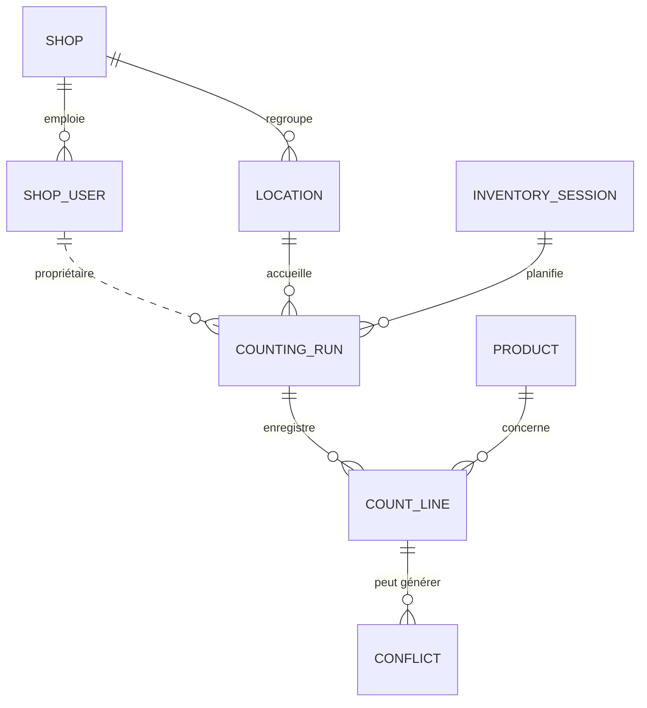
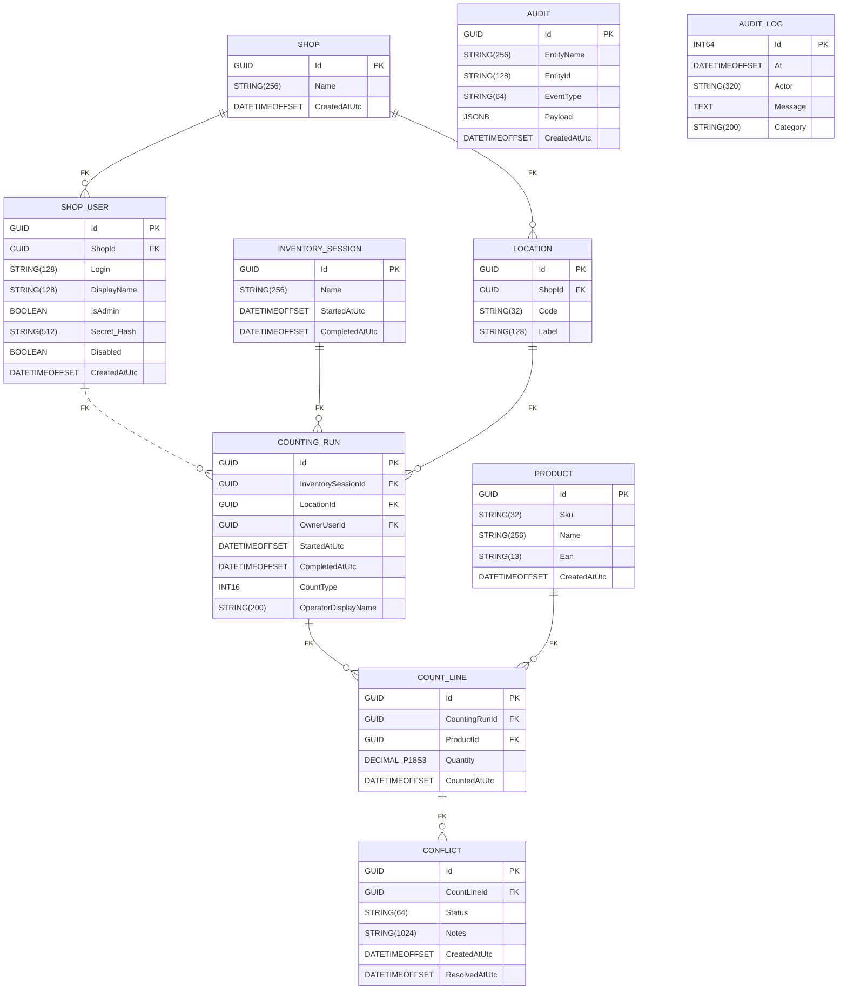

# Modélisation des données

Ce document synthétise la structure actuelle de la base PostgreSQL gérée par les migrations FluentMigrator du projet `inventory-infra`.

## Modèle Conceptuel de Données (MCD)

- **Shop** : boutique CinéBoutique (Paris, Bordeaux, Montpellier, Marseille, Bruxelles).
- **ShopUser** : compte utilisateur lié à une boutique (administrateur ou opérateur, secret haché Argon2/bcrypt).
- **Location** : zone physique de stockage (codes `B1` à `B20`, `S1` à `S19`).
- **InventorySession** : campagne d'inventaire regroupant plusieurs comptages.
- **CountingRun** : passage de comptage effectué sur une zone donnée.
- **CountLine** : quantité relevée pour un produit dans un run.
- **Product** : référence commerciale identifiée par SKU/EAN.
- **Conflict** : différentiel entre deux comptages d'une même zone.
- **Audit** et **audit_logs** : tables d'historisation techniques non reliées par clé étrangère.

## Modèle Physique de Données (MPD)

> ℹ️ `DECIMAL_P18S3` correspond à une colonne `DECIMAL(18,3)` dans PostgreSQL. La notation a été ajustée pour rester compatible avec Mermaid.

## Synthèse des contraintes

| Table | Clés principales | Index / Contraintes notables |
| --- | --- | --- |
| `Shop` | `Id` | Index unique `UQ_Shop_LowerName` (nom en minuscule). |
| `ShopUser` | `Id` | Index unique `UQ_ShopUser_Login` (`ShopId`, lower(`Login`)), FK `FK_ShopUser_Shop`. |
| `Product` | `Id` | Index uniques sur `Sku` et `Ean`. |
| `Location` | `Id` | Index unique `IX_Location_Code` (héritage) + `UQ_Location_Shop_Code` (`ShopId`, upper(`Code`)), FK `FK_Location_Shop`. |
| `InventorySession` | `Id` | — |
| `CountingRun` | `Id` | Index partiel `IX_CountingRun_Location_CountType_Open`, index unique `ux_countingrun_active_triplet`, FK optionnelle `FK_CountingRun_Owner`. |
| `CountLine` | `Id` | FK vers `CountingRun` et `Product`. |
| `Conflict` | `Id` | FK vers `CountLine`. |
| `Audit` | `Id` | Index composé `IX_Audit_Entity` (`EntityName`, `EntityId`). |
| `audit_logs` | `id` | Table annexe pour la journalisation technique. |

## Seed disponible

- 5 boutiques (`CinéBoutique Paris`, `Bordeaux`, `Montpellier`, `Marseille`, `Bruxelles`) et rattachement automatique des zones existantes à Paris.
- Zones de démonstration `A` à `E` pour chaque boutique hors Paris.
- Comptes `ShopUser` : `administrateur` (IsAdmin) + `utilisateur1..5` (Paris) ou `utilisateur1..4` (autres boutiques), `Secret_Hash` nul par défaut.
- 39 zones historiques (`B1` à `B20`, `S1` à `S19`) conservées pour compatibilité.
- Aucun produit ni comptage n'est injecté par défaut : toute donnée métier supplémentaire doit être créée via l'API ou des scripts dédiés.

Ces représentations visuelles peuvent être rendues directement dans GitHub grâce au support de Mermaid.
