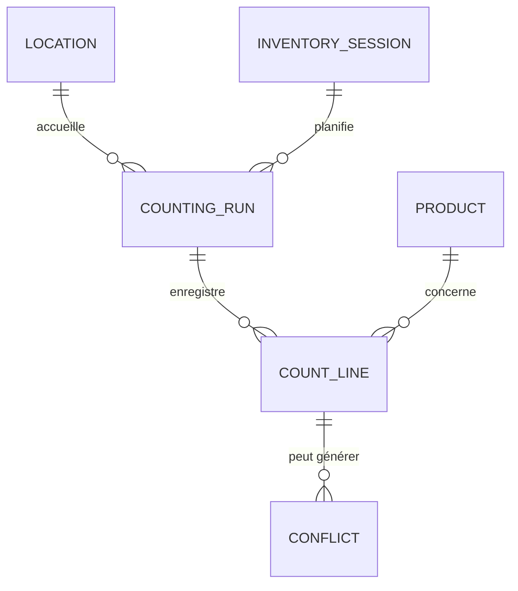

# Modélisation des données

Ce document synthétise la structure actuelle de la base PostgreSQL gérée par les migrations FluentMigrator du projet `inventory-infra`.

## Modèle Conceptuel de Données (MCD)



- **Location** : zone physique de stockage (codes `B1` à `B20`, `S1` à `S19`).
- **InventorySession** : campagne d'inventaire regroupant plusieurs comptages.
- **CountingRun** : passage de comptage effectué sur une zone donnée.
- **CountLine** : quantité relevée pour un produit dans un run.
- **Product** : référence commerciale identifiée par SKU/EAN.
- **Conflict** : différentiel entre deux comptages d'une même zone.
- **Audit** et **audit_logs** : tables d'historisation techniques non reliées par clé étrangère.

## Modèle Physique de Données (MPD)

```mermaid
erDiagram
    PRODUCT {
        GUID Id PK
        STRING(32) Sku
        STRING(256) Name
        STRING(13) Ean
        DATETIMEOFFSET CreatedAtUtc
    }
    LOCATION {
        GUID Id PK
        STRING(32) Code
        STRING(128) Label
    }
    INVENTORY_SESSION {
        GUID Id PK
        STRING(256) Name
        DATETIMEOFFSET StartedAtUtc
        DATETIMEOFFSET CompletedAtUtc
    }
    COUNTING_RUN {
        GUID Id PK
        GUID InventorySessionId FK
        GUID LocationId FK
        DATETIMEOFFSET StartedAtUtc
        DATETIMEOFFSET CompletedAtUtc
        INT16 CountType
        STRING(200) OperatorDisplayName
    }
    COUNT_LINE {
        GUID Id PK
        GUID CountingRunId FK
        GUID ProductId FK
        DECIMAL(18,3) Quantity
        DATETIMEOFFSET CountedAtUtc
    }
    CONFLICT {
        GUID Id PK
        GUID CountLineId FK
        STRING(64) Status
        STRING(1024) Notes
        DATETIMEOFFSET CreatedAtUtc
        DATETIMEOFFSET ResolvedAtUtc
    }
    AUDIT {
        GUID Id PK
        STRING(256) EntityName
        STRING(128) EntityId
        STRING(64) EventType
        JSONB Payload
        DATETIMEOFFSET CreatedAtUtc
    }
    AUDIT_LOG {
        INT64 Id PK
        DATETIMEOFFSET At
        STRING(320) Actor
        TEXT Message
        STRING(200) Category
    }

    INVENTORY_SESSION ||--o{ COUNTING_RUN : "FK"
    LOCATION ||--o{ COUNTING_RUN : "FK"
    COUNTING_RUN ||--o{ COUNT_LINE : "FK"
    PRODUCT ||--o{ COUNT_LINE : "FK"
    COUNT_LINE ||--o{ CONFLICT : "FK"
```

## Synthèse des contraintes

| Table | Clés principales | Index / Contraintes notables |
| --- | --- | --- |
| `Product` | `Id` | Index uniques sur `Sku` et `Ean`. |
| `Location` | `Id` | Index unique `IX_Location_Code`. |
| `InventorySession` | `Id` | — |
| `CountingRun` | `Id` | Index partiel `IX_CountingRun_Location_CountType_Open`, index unique `ux_countingrun_active_triplet`. |
| `CountLine` | `Id` | FK vers `CountingRun` et `Product`. |
| `Conflict` | `Id` | FK vers `CountLine`. |
| `Audit` | `Id` | Index composé `IX_Audit_Entity` (`EntityName`, `EntityId`). |
| `audit_logs` | `id` | Table annexe pour la journalisation technique. |

## Seed disponible

- 39 zones (`B1` à `B20`, `S1` à `S19`) créées via `InventoryDataSeeder` et/ou la migration `202404010002_SeedLocations`.
- 5 utilisateurs de démonstration (`appsettings.Development.json`) authentifiés par PIN.
- Aucun produit ni comptage n'est injecté par défaut : toute donnée métier supplémentaire doit être créée via l'API ou des scripts dédiés.

Ces représentations visuelles peuvent être rendues directement dans GitHub grâce au support de Mermaid.
