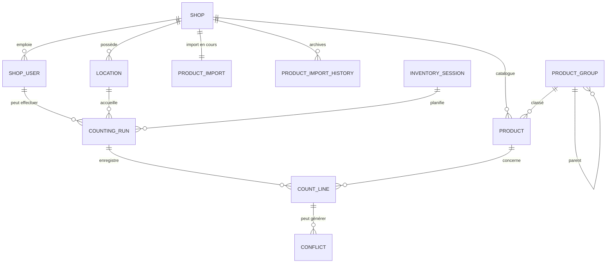
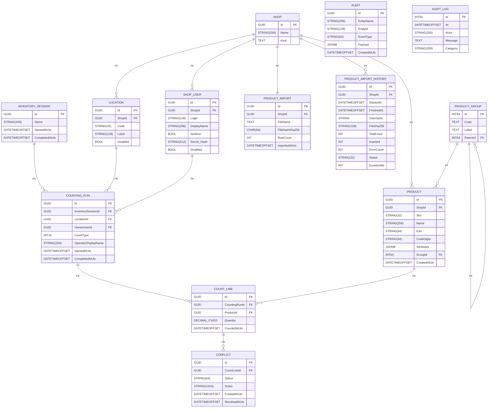

# Modélisation des données

Ce document synthétise la structure actuelle de la base PostgreSQL pilotée par les migrations FluentMigrator du projet `inventory-infra`. Il est à jour de la migration de baseline `20260101_000001_InitialSchema`.

## Modèle Conceptuel de Données (MCD)



- **Shop** : entité boutique (`Kind` ∈ {`boutique`,`lumiere`,`camera`}) servant de racine aux catalogues et aux utilisateurs.
- **Location** : zone physique (codes `B1` à `B20`, `S1` à `S19`) rattachée à une boutique et pouvant être désactivée.
- **ShopUser** : compte magasin avec contrainte d'unicité par boutique sur `Login` et `DisplayName`.
- **ProductGroup** : classification hiérarchique optionnelle des produits (auto-référence `ParentId`).
- **Product** : référence commerciale contextualisée par boutique (`ShopId`), enrichie d'attributs JSON et d'index de recherche trigramme.
- **ProductImport** / **ProductImportHistory** : suivi des imports catalogue (état courant + historique horodaté).
- **InventorySession**, **CountingRun**, **CountLine**, **Conflict** : cycle de vie d'un inventaire terrain.
- **Audit** et **audit_logs** : journalisation fonctionnelle et technique indépendante du domaine.

## Modèle Physique de Données (MPD)



> ℹ️ `DECIMAL_P18S3` correspond à une colonne `DECIMAL(18,3)` dans PostgreSQL. La notation a été ajustée pour rester compatible avec Mermaid.

## Synthèse des contraintes

| Table | Clés principales | Index / Contraintes notables |
| --- | --- | --- |
| `Shop` | `Id` | `ck_shop_kind_allowed`, index unique `UQ_Shop_LowerName`, index `ix_shop_kind` sur `lower(Kind)`. |
| `ShopUser` | `Id` | Index unique `UQ_ShopUser_Shop_LowerLogin`, contrainte `uq_shopuser_shopid_displayname`, index `ix_shopuser_shopid_displayname`. |
| `ProductGroup` | `Id` | Contrainte `uq_productgroup_code`, auto-FK `FK_ProductGroup_ProductGroup_ParentId`, index GIN `ix_productgroup_label_trgm`. |
| `Product` | `Id` | Index unique `UX_Product_Shop_LowerSku`, index partiel `IX_Product_Shop_Ean`, index `IX_Product_Shop_LowerSku`, `IX_Product_Shop_LowerEan`, `IX_Product_Shop_CodeDigits`, `ix_product_codedigits`, GIN `ix_product_attributes_gin`, `ix_product_sku_trgm`, `ix_product_ean_trgm`, `ix_product_name_trgm`, `IX_Product_Shop_Name_trgm`. |
| `Location` | `Id` | Index unique `UQ_Location_Shop_Code`, index `IX_Location_ShopId_Code`. |
| `InventorySession` | `Id` | — |
| `CountingRun` | `Id` | Index partiel `IX_CountingRun_Location_CountType_Open`, index unique `ux_countingrun_active_triplet`, index `ix_countingrun_owneruserid`. |
| `CountLine` | `Id` | FK vers `CountingRun` et `Product`. |
| `Conflict` | `Id` | FK vers `CountLine`. |
| `ProductImport` | `Id` | Contrainte `uq_productimport_shopid`, index unique `ux_productimport_shopid_filehash`. |
| `ProductImportHistory` | `Id` | Index `IX_ProductImportHistory_StartedAt`, `IX_ProductImportHistory_FileSha256`, `IX_ProductImportHistory_ShopId`. |
| `Audit` | `Id` | Index composé `IX_Audit_Entity`. |
| `audit_logs` | `id` | Table annexe pour la journalisation technique. |

## Seed disponible

- Boutiques insérées par la baseline : `CinéBoutique Saint-Denis` (boutique), `CinéBoutique Belgique` (boutique), `Lumière Saint-Denis`, `Lumière Marseille`, `Lumière Montpellier`, `Lumière Bordeaux`, `Lumière Belgique` (type `lumiere`).
- Zones par défaut : 39 emplacements `B1` à `B20` et `S1` à `S19` rattachés à `CinéBoutique Saint-Denis` (colonne `Disabled` positionnée à `false`).
- Aucune donnée produit ni utilisateur n'est injectée automatiquement en dehors de ces seeds ; les jeux de données de démo restent fournis par les scripts/applications existantes (ex. `InventoryDataSeeder`).

## Procédure de baseline

Pour basculer un environnement existant sur la baseline `20260101000001` sans rejouer toutes les migrations historiques :

1. Sauvegarder le schéma, puis ouvrir une session SQL sur la base cible.
2. Vider la table de suivi des migrations (par défaut `public."VersionInfo"`).
   ```sql
   DELETE FROM "public"."VersionInfo";
   ```
3. Enregistrer la version appliquée correspondant à la baseline.
   ```sql
   INSERT INTO "public"."VersionInfo" ("Version", "AppliedOn", "Description")
   VALUES (20260101000001, NOW(), 'Baseline InitialSchema');
   ```
4. Les déploiements FluentMigrator reprendront ensuite normalement : les bases vierges exécuteront la migration `20260101_000001_InitialSchema`, les autres considèreront la structure comme déjà appliquée.

Ces représentations visuelles peuvent être rendues directement dans GitHub grâce au support de Mermaid.
