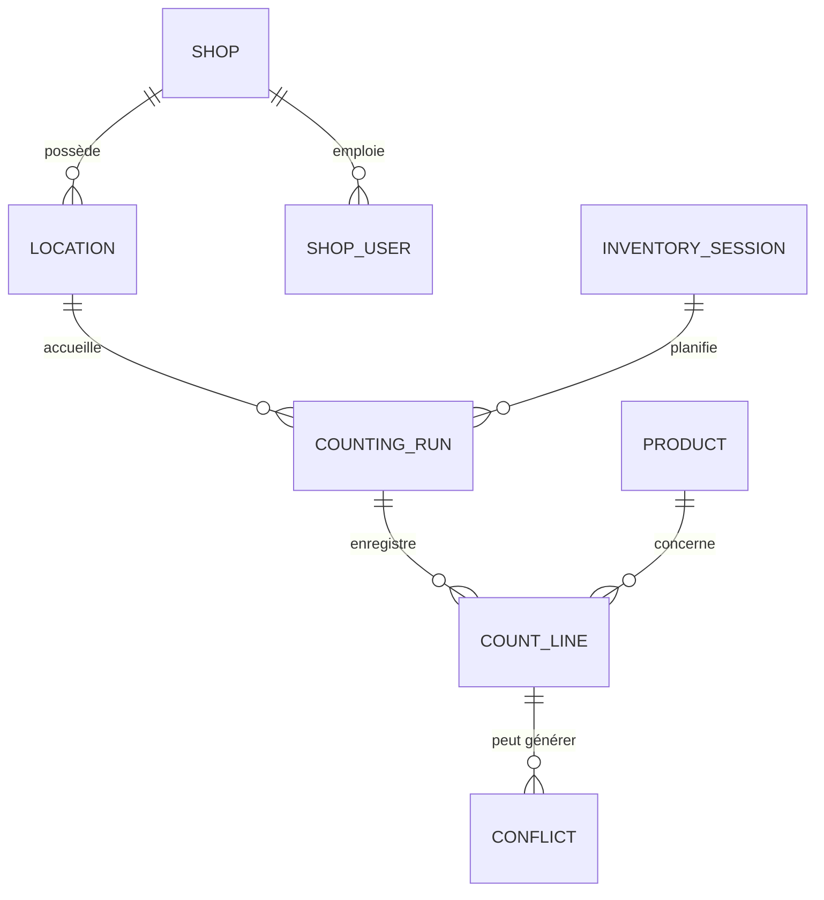
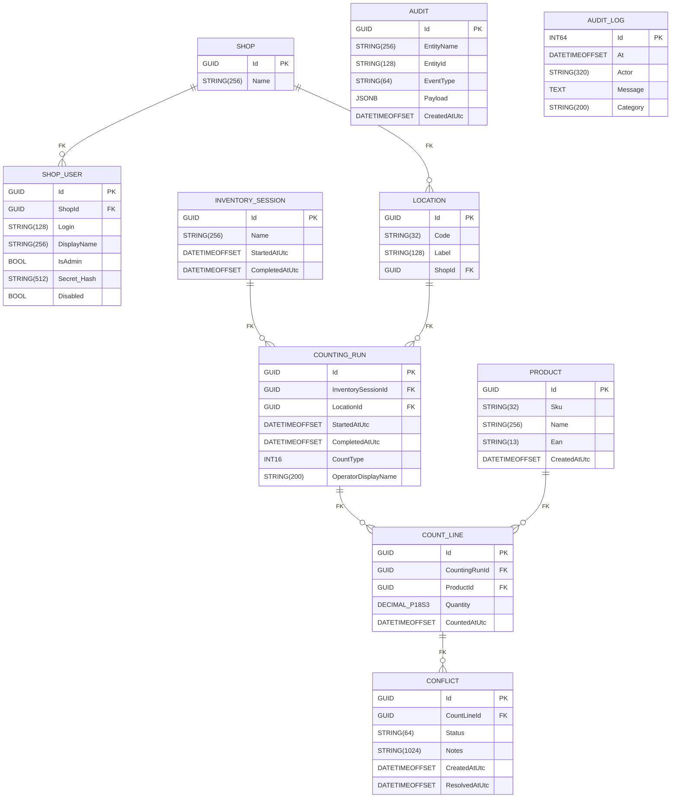

# Modélisation des données

Ce document synthétise la structure actuelle de la base PostgreSQL gérée par les migrations FluentMigrator du projet `inventory-infra`.

## Modèle Conceptuel de Données (MCD)

- **Shop** : boutique physique (Paris, Bordeaux, Montpellier, Marseille, Bruxelles).
- **Location** : zone physique de stockage (codes `B1` à `B20`, `S1` à `S19`) rattachée à une boutique.
- **ShopUser** : compte utilisateur rattaché à une boutique pour l'usage en magasin.
- **InventorySession** : campagne d'inventaire regroupant plusieurs comptages.
- **CountingRun** : passage de comptage effectué sur une zone donnée.
- **CountLine** : quantité relevée pour un produit dans un run.
- **Product** : référence commerciale identifiée par SKU/EAN.
- **Conflict** : différentiel entre deux comptages d'une même zone.
- **Audit** et **audit_logs** : tables d'historisation techniques non reliées par clé étrangère.

## Modèle Physique de Données (MPD)

> ℹ️ `DECIMAL_P18S3` correspond à une colonne `DECIMAL(18,3)` dans PostgreSQL. La notation a été ajustée pour rester compatible avec Mermaid.

## Synthèse des contraintes

| Table | Clés principales | Index / Contraintes notables |
| --- | --- | --- |
| `Shop` | `Id` | Index unique `UQ_Shop_LowerName` sur `LOWER(Name)`. |
| `ShopUser` | `Id` | Index unique `UQ_ShopUser_Shop_LowerLogin` sur (`ShopId`, `LOWER(Login)`). |
| `Product` | `Id` | Index uniques sur `Sku` et `Ean`. |
| `Location` | `Id` | Index unique `UQ_Location_Shop_Code` (`ShopId`, `UPPER(Code)`). |
| `InventorySession` | `Id` | — |
| `CountingRun` | `Id` | Index partiel `IX_CountingRun_Location_CountType_Open`, index unique `ux_countingrun_active_triplet`. |
| `CountLine` | `Id` | FK vers `CountingRun` et `Product`. |
| `Conflict` | `Id` | FK vers `CountLine`. |
| `Audit` | `Id` | Index composé `IX_Audit_Entity` (`EntityName`, `EntityId`). |
| `audit_logs` | `id` | Table annexe pour la journalisation technique. |

## Seed disponible

- 5 boutiques (`CinéBoutique Paris`, `CinéBoutique Bordeaux`, `CinéBoutique Montpellier`, `CinéBoutique Marseille`, `CinéBoutique Bruxelles`).
- 39 zones (`B1` à `B20`, `S1` à `S19`) rattachées par défaut à `CinéBoutique Paris`, créées via `InventoryDataSeeder` et/ou la migration `202404010002_SeedLocations` complétée par la migration `202410010001_AddShopTableAndLocationShopRelation`.
- Comptes utilisateurs de démonstration injectés par `InventoryDataSeeder` : un administrateur par boutique (`login=administrateur`) et des comptes "Utilisateur n" (Paris : 5 comptes supplémentaires, autres boutiques : 4).
- 5 utilisateurs de démonstration (`appsettings.Development.json`) authentifiés par PIN.
- Aucun produit ni comptage n'est injecté par défaut : toute donnée métier supplémentaire doit être créée via l'API ou des scripts dédiés.

Ces représentations visuelles peuvent être rendues directement dans GitHub grâce au support de Mermaid.
